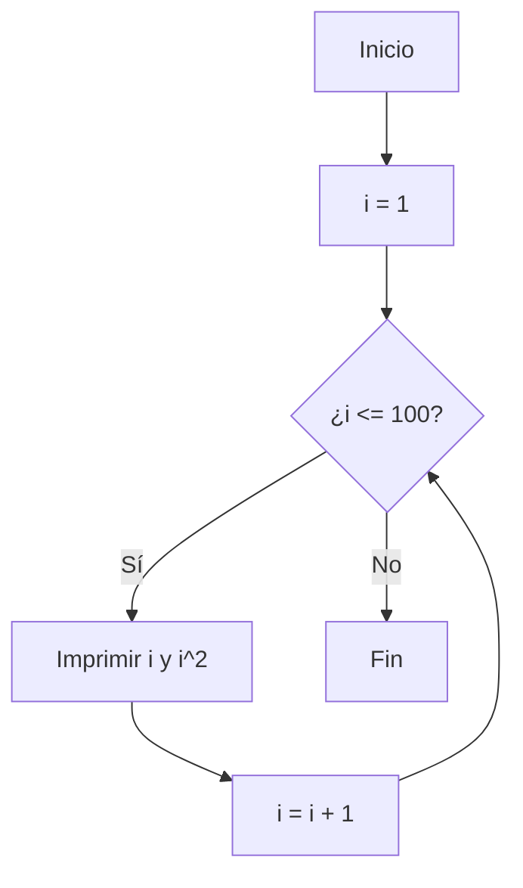
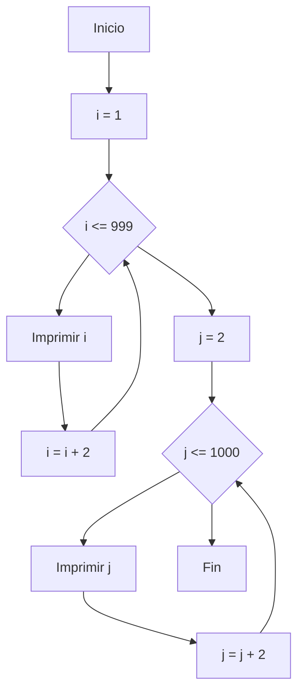
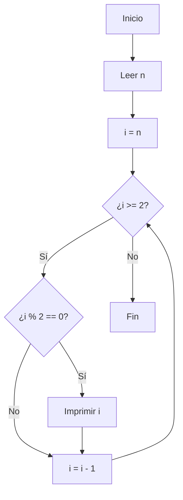

# RETO 6
## 1. Imprimir un listado con los números del 1 al 100 cada uno con su respectivo cuadrado

```
for i in range(1, 101):
    print(f"{i} -> {i**2}")

```


## 2. Imprimir un listado con los números impares desde 1 hasta 999 y seguidamente otro listado con los números pares desde 2 hasta 1000
```
print("Impares del 1 al 999:")
for i in range(1, 1000, 2):
    print(i, end=", ")

print("\n\nPares del 2 al 1000:")
for i in range(2, 1001, 2):
    print(i, end=", ")

```



## 3. Imprimir los números pares en forma descendente hasta 2 que son menores o iguales a un número natural n ≥ 2 dado
```
n = int(input("Ingrese un número natural n (n ≥ 2): "))
print(f"Pares desde {n} hasta 2:")
for i in range(n, 1, -1):
    if i % 2 == 0:
        print(i, end=", ")

```

## 4. Imprimir el factorial de un número natural n dado

```
n = int(input("Ingrese un número natural: "))
factorial = 1
for i in range(1, n + 1):
    factorial *= i
print(f"El factorial de {n} es: {factorial}")

```
## 5. Implementar un programa que ingrese un número de 2 a 50 y muestre sus divisores.
```
n = int(input("Ingrese un número entre 2 y 50: "))
if 2 <= n <= 50:
    print(f"Divisores de {n}:")
    for i in range(1, n + 1):
        if n % i == 0:
            print(i, end=", ")
else:
    print("Número fuera de rango.")

```
## 6. Implementar el algoritmo que muestre los números primos del 1 al 100
```

def es_primo(num):
    if num < 2:
        return False
    for i in range(2, int(num**0.5) + 1):
        if num % i == 0:
            return False
    return True

print("Números primos del 1 al 100:")
for i in range(1, 101):
    if es_primo(i):
        print(i, end=", ")

```
